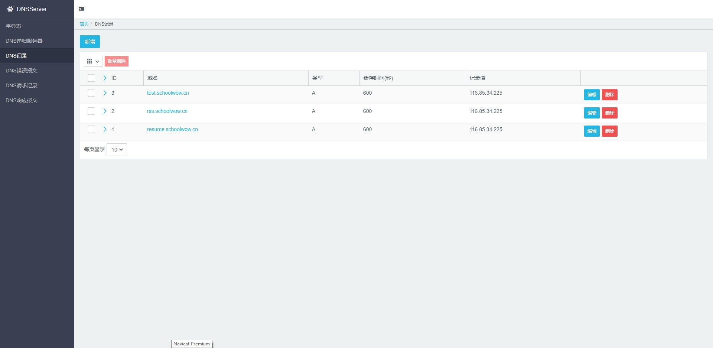

# DNS记录

您可以在DNS记录里添加相应信息.比如您希望访问a.com的时候访问机器127.0.0.1,那么步骤如下:

* 点击[新增]
* 输入域名为a.com
* 输入记录值为127.0.0.1
* 点击[确认]

接下来您需要将电脑的DNS服务器设置为DNS服务器的IP地址.

设置window电脑的DNS服务器教程[点此打开](https://jingyan.baidu.com/article/6b182309a91cbdba58e15939.html)

设置好DNS服务器后,输入网址a.com访问的就是127.0.0.1.

